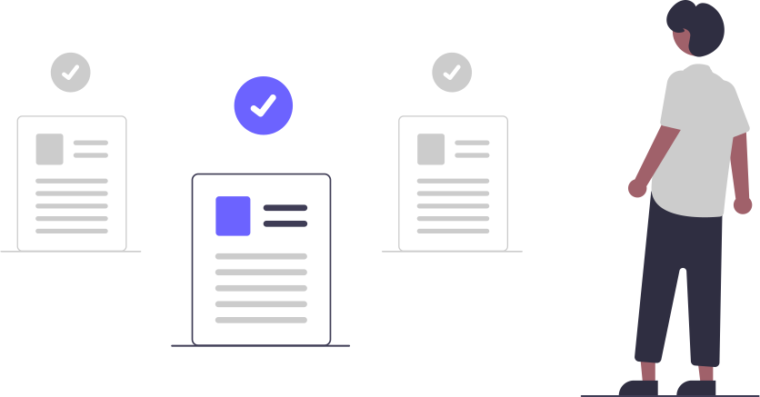

<h1 align='center'>📝 Recommendation System Documentation 📝</h1>

  

---

# Datasets

[Kaggle | 🗂️ MyAnimesList Datasets - 2023](https://www.kaggle.com/datasets/dsfelix/animes-dataset-2023)

[Bonus | ⛏️ API Scrapper](https://github.com/CSFelix/recommendation-system/blob/main/bonus%20-%20scrapper.ipynb)

---

# Codes

[Recommendation System - MBA USP\ESAQL | 💻 Recommendation Systems](https://github.com/CSFelix/recommendation-system-mba-usp-esalq/tree/main)

---

# Notebooks

[0 | 📃 Final Result FDE](https://github.com/CSFelix/recommendation-system-documentation/blob/main/src/0%20-%20Documentação%20-%20Resultado%20FDE.pdf)

[1 | 📃 Planner](https://github.com/CSFelix/recommendation-system-documentation/blob/main/src/1.1%20-%20Planner.pptx)

[2 | 📃 Research Project](https://github.com/CSFelix/recommendation-system-documentation/blob/main/src/1.2%20-%20Projeto%20de%20Pesquisa.docx)

[3 | 📃 Preliminary Results](https://github.com/CSFelix/recommendation-system-documentation/blob/main/src/1.3%20-%20Resultados%20Preliminares.docx)

[4 | 📃 Capstone](https://github.com/CSFelix/recommendation-system-documentation/blob/main/src/1.4%20-%20TCC.docx)

[5.0 | 📃 Slides (Final Version)](https://github.com/CSFelix/recommendation-system-documentation/blob/main/src/1.5%20-%20Slides.pptx)

[5.1 | 📃 Slides (Alternative Version)](https://github.com/CSFelix/recommendation-system-documentation/blob/main/src/1.5%20-%20Slides%20-%20alpha%20version.pptx)
